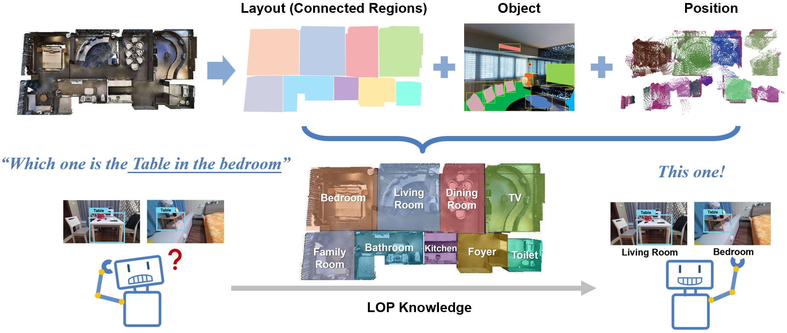
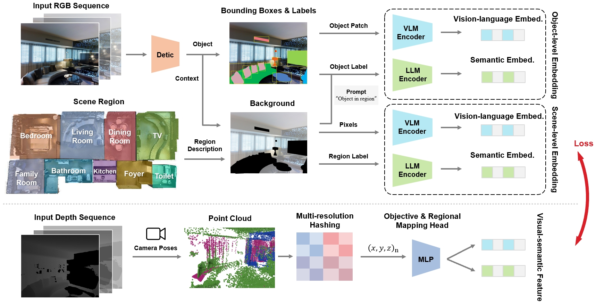
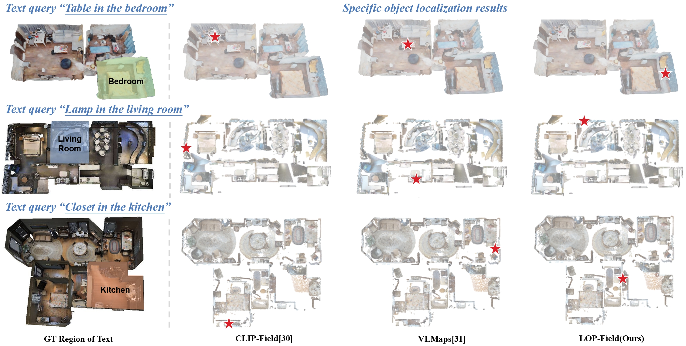
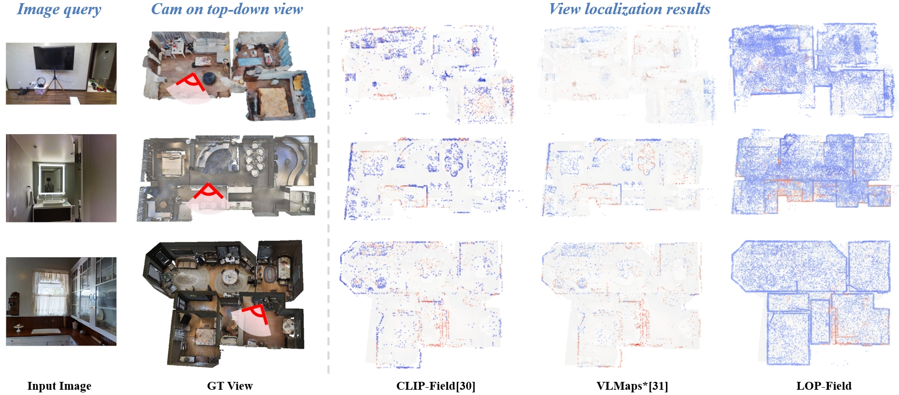

# LOP-Field: Brain-inspired Layout-Object-Position Fields for Robotic Scene Understanding

### Realizing the Layout-Object-Position(LOP) association to model the hierarchical representations for robotic scene understanding

[[Paper]](https://arxiv.org/abs/2406.05985) [[Website]](https://jarvishou829.github.io/LOP-Field/) [[Code]](https://github.com/jarvishou829/LOP-Field)

Authors: [Jiawei Hou](https://jarvishou829.github.io/), [Wenhao Guan](), [Xiangyang Xue](), [Taiping Zeng]().

**Tl;dr** Recently, it has been found that a neural population in the postrhinal cortex of rat brains is more strongly tuned to the spatial layout rather than objects in a scene. Inspired by the representations of spatial layout in local scenes to encode different regions separately, we proposed LOP-Field that realizes the Layout-Object-Position(LOP) association to model the hierarchical representations for robotic scene understanding.

Dividing the scene information into layout, object, and position, and modeling them explicitly, layout-object-position association enables robots to address relative problems and realize a more comprehensive spatial cognition.

Pipeline of the target embedding processing and neural implicit rendering during training. Above is the ground truth generation of layout-object-position vision-language and semantic embeddings for weakly-supervising. Below is the neural implicit network mapping 3D positions to target feature space. A contrastive loss is optimized against each other.

## Text Query Localization Results on Datasets

## Image Query Localization Results on Datasets

## Code Release (Coming Soon)
